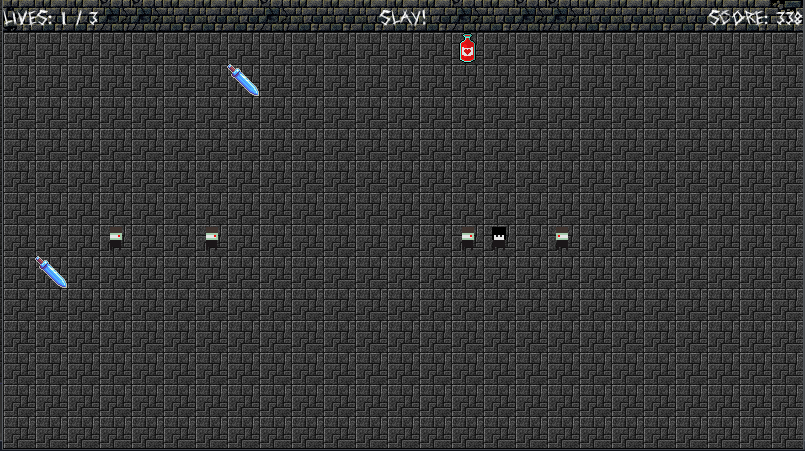

= Academia: Fall of the Citadel

Copyright 2024 Academia Team

All code is licensed under the link:LICENSE.txt[0BSD] license.

All images, if unspecified, have been created by the Academia Team and are under
the https://creativecommons.org/publicdomain/zero/1.0/legalcode[CC0 License].
The origins of all other images are specified throughout the repository and within
the game.

*Academia: Fall of the Citadel* is a 2D grid-based survival game. You are the last
remaining soldier in the north. Defend the last citadel against the darkness for
as long as possible. For it will eventually fall.

Before attempting to export the game in Godot, please change into the directory
containing the repository and run the `build_prep` script.

For gameplay details, please check out the in-game instructions.